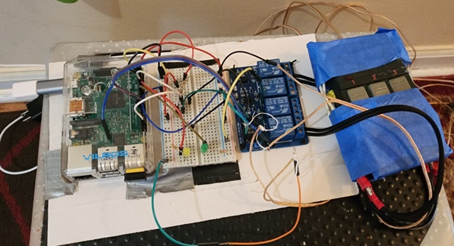
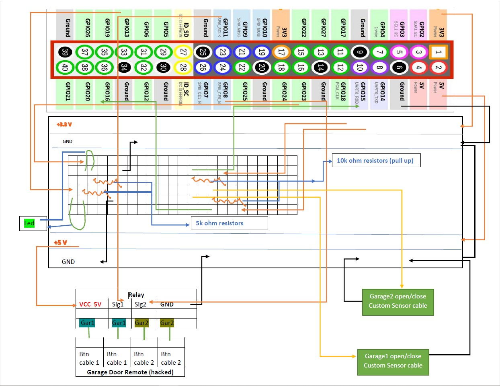
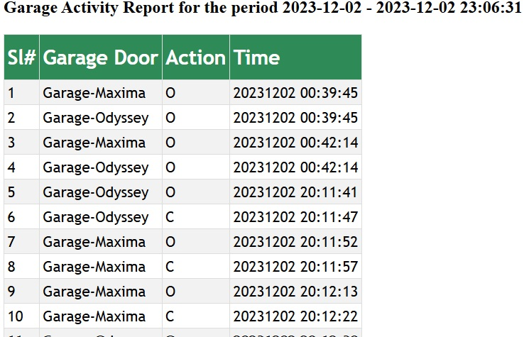
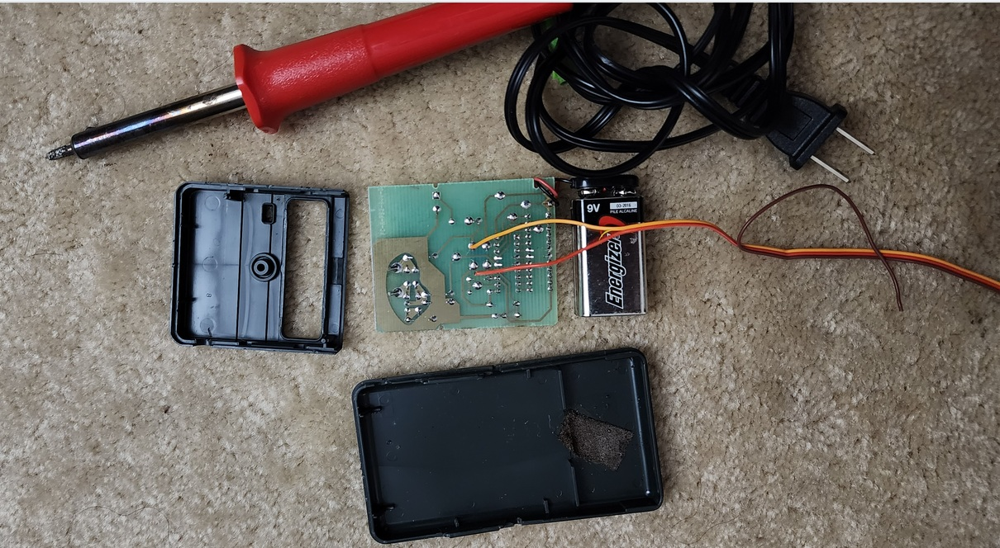
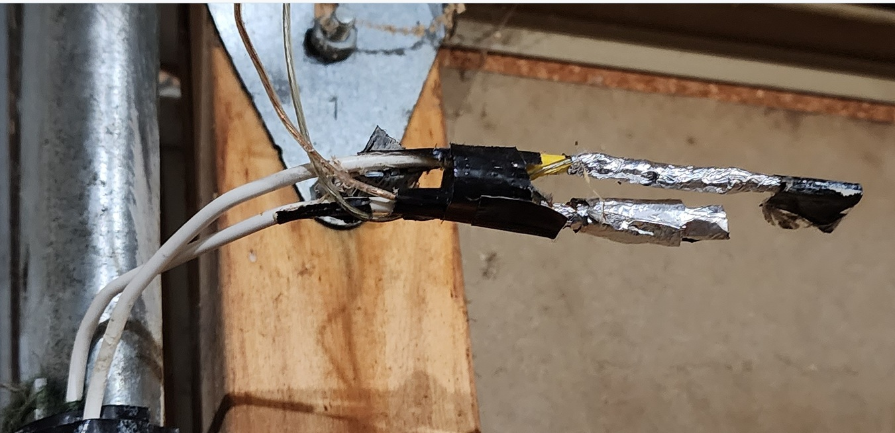

# Harvard University - CS50 Introduction to Computer Programming
## Final Project: Garage Door Remote controller using Raspberry Pi. 
## Created By Tanuj Siva & Tarun Siva in 2023.

## Video Demo: https://youtu.be/Eo80DMoXrf4

The Garage Door Opener/Monitor solution is built on Raspberry Pi and this allows the owners to open/close or monitor the garage doors remotely from anywhere in the world in a secured way without using any custom app. DropBox is used as the cloud storage and also used as a remote control to control the garage doors. SQLite database is used as local storage to store the garage door activities for reporting purposes. Currently this solution supports up to 2 garage doors. <p>
The control file – garage.txt in the DropBox app needs to be edited and provide the appropriate control code (S for Status check, A for Activate the door) for each door. The Raspberry Pi downloads this control file every minute and completes the action per the instruction code provided. It then sends an email and upload the garage door status (open/closed) in an html file back to the Dropbox. The owners can see the completion status from the email or from the Dropbox app. If the garage is open, the corresponding Led light would light up as a visible indicator on the breadboard.<p>
The Raspberry Pi also monitors the garage door status every second and it sends an email notification if there is an activity such as open/close. The garage status html file on the Dropbox would also be refreshed upon each activity. A shell script is also developed to create the garage door activity report in a HTML for a given period. <p>
The project is built on Python 3, SQLite3, SQLAlchemy, Shell scripts, Dropbox APIs. DropBox API key & secret keys need to be setup as part of the configuration.


### Technology Stack/Requirements
```bash
This solution needs the following:
•	A Raspberry Pi Model 2 or later 
•	A breadboard
•	A two-module relay
•	A spare remote (with 2 buttons for 2 Door garage) 
•	Two 5K Ohm resistors (for LEDs)
•	Two 10K ohm resistors (For custom garage door sensor)
•	A few breadboard connectors.
•	A garage remote with cables soldered on the button circuit.
```
## Source Files

| File | Description |
|------|-------------|
| activityreport.py | Garage Door Activity Report generator |
| activityreport.sh | Wrapper script for the above |
| dbutils/garage.db | SqLite3 Database |
| dbutils.py | Database utility to create/insert/query activities table. |
| dropbox_uploader.sh | Drop box uploader |
| garage.properties | Garage Door property file |
| garage.py | Main python script that controls the garage doors. |
| garage.txt | Control file |
| mailsetup.py | Email Utility |
| static | Contains the HTML Files |
| static/activityreport.html | Activity Report file |
| static/activitytemplate.html | Activity Report Template |
| static/garagestatus.html | Garage Status Report |

## Circuit Diagream - Raspberry Pi Model 2B


## Garage Door Activity Report


## Garage Remote Control with Soldered wires 


## Garage Door Custom sensor 
The picture shows that the two cables are in open position when the garage is open. These two cables will be in contact when the door is closed.


## Garage Door Status 
An email in HTML format will be sent to the list of recipients configured in the .env file. A notification will also be sent through the Dropbox app. A Sample email alert is shown below:


## Requirements

- **Device**: Created with Raspbeery Pi 2B
- **Software**: Python3, DropBox account with API Keys, and SMTP accounts for email alerts
- **Mobile App**: DropBox App


## Setup

1. **Install Python & GPIO libraries** 
   ```bash
   pip3 install RPi.GPIO
   ```

2. **Run the application:**
   ```bash
      Go to the projects folder
      python3 garage.py
   ```

## Courtesy 
```bash
DropBox Uploader utility - Andrea Fabrizi (https://github.com/andreafabrizi/Dropbox-Uploader)
GPIO Pins Usage - Paul McWhorter - https://www.youtube.com/watch?v=0OYtR8UdZQk&t=2181s
```
